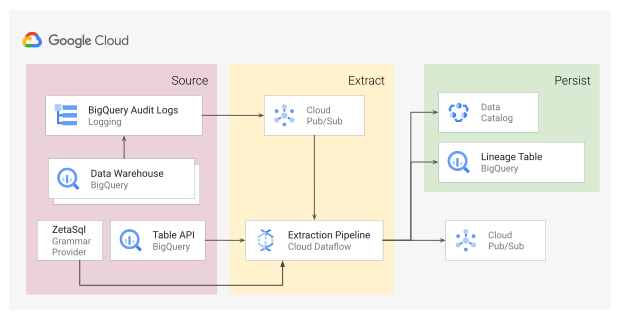

[](https://sonarcloud.io/dashboard?id=GoogleCloudPlatform_bigquery-data-lineage)
[](https://sonarcloud.io/dashboard?id=GoogleCloudPlatform_bigquery-data-lineage)
[](https://sonarcloud.io/dashboard?id=GoogleCloudPlatform_bigquery-data-lineage)
[](https://sonarcloud.io/dashboard?id=GoogleCloudPlatform_bigquery-data-lineage)
[](https://sonarcloud.io/dashboard?id=GoogleCloudPlatform_bigquery-data-lineage)
[](https://lgtm.com/projects/g/GoogleCloudPlatform/bigquery-data-lineage/alerts/)

# BigQuery Data Lineage using Audit Logs, Pub/Sub, Dataflow and Data Catalog

In a big-data environment, operational systems feed the data-warehouse with fresh data, which is processed through multiple pipelines designed by data-engineers into business consumable information, that is analysed by business users through a variety of methods of merging and transforming to gain insights. Knowing the details of its origin, how it got there, and how it’s flowing through the business is paramount to its value.

[Data Lineage](https://en.wikipedia.org/wiki/Data_lineage) is the ability to trace origin and transformations that the data goes through over time. Traceability in a big data system is critical from a data-governance standpoint to put safe-guards on sensitive data and also to ensure that data including metadata stays within the customer’s Cloud Organisation or Project. This solution shall introduce you to a reference implementation for a Lineage system for [Big Query](https://cloud.google.com/bigquery).

### Reference Architecture



The system uses Audit Logs emitted from BigQuery to identify operation's lineage information. A messaging system (Pub/Sub) is used for consuming the logs in real time to ensure system level decoupling. The Dataflow pipelines then processes the job information to build data lineage by parsing the query’s SQL using [ZetaSQL](https://github.com/google/zetasql) as Query Grammar provider. It captures the table schema using BigQuery API and persists the generated lineage in a BigQuery table and also as Tags in Data Catalog. The Lineage table can then be queried to identify complete flow of data in the warehouse. 


> This solution only works on Linux or MacOS X due [ZetaSQL](https://github.com/google/zetasql) JNI connectors not being avaiable for Windows at the moment.

## Quick Start

[](https://console.cloud.google.com/cloudshell/editor?cloudshell_git_repo=https://github.com/GoogleCloudPlatform/bigquery-data-lineage.git)

### Setup environment variables
1. Set values for variables in `set_variables.sh` file.<br/>This allows you to set all option values in one place.
2. Activate all environment variables.
    ```shell script
    source set_variables.sh
    ```
### Enable required GCP services
```shell script
gcloud services enable \
bigquery.googleapis.com \
datacatalog.googleapis.com \
dataflow.googleapis.com \
pubsub.googleapis.com
```

### Enable BigQuery Audit Logs to PubSub
1. Create Pub/Sub topic.
    ```shell script
    gcloud pubsub topics create $AUDIT_LOGS_PUBSUB_TOPIC --project $PROJECT_ID
   ```` 
2. Send Audit Logs to PubSub <br>
    ```shell script
    gcloud logging sinks create $LOG_SINK_ID \
    pubsub.googleapis.com/projects/$PROJECT_ID/topics/$AUDIT_LOGS_PUBSUB_TOPIC \
    --log-filter="protoPayload.metadata.\"@type\"=\"type.googleapis.com/google.cloud.audit.BigQueryAuditMetadata\" \
   protoPayload.methodName=\"google.cloud.bigquery.v2.JobService.InsertJob\" \
   operation.last=true"
    ```
3. Give Pub/Sub “Publisher” permission Logging service account to enable it for pushing the log entries.
    ```shell script
    # Identify the Logs writer service account 
    export LOGGING_WRITER_IDENTITY="$(gcloud logging sinks describe $LOG_SINK_ID --format="get(writerIdentity)" --project $PROJECT_ID)"
    
    # Grant Publish permission to the Logging writer
    gcloud pubsub topics add-iam-policy-binding $AUDIT_LOGS_PUBSUB_TOPIC \
    --member=$LOGGING_WRITER_IDENTITY \
    --role='roles/pubsub.publisher' \
    --project $PROJECT_ID
    ```
### Setup BigQuery Table for storing Lineage
1. Create dataset
    ```shell script
    bq --location=$BIGQUERY_REGION \
    --project_id=$PROJECT_ID \
    mk --dataset $DATASET_ID
    ```
2. Create Table using schema
    ```shell script
    bq mk --table \
    --project_id=$PROJECT_ID \
    --description "Data Lineage table" \
    --time_partitioning_field "reconcileTime" \
    $DATASET_ID.$LINEAGE_TABLE_ID \
    lineage_bigquery_table_schema.json
    ```

### Create [Data Catalog](https://cloud.google.com/data-catalog) Tag Template
```shell script
gcloud data-catalog tag-templates create $LINEAGE_TAG_TEMPLATE_NAME \
--project $PROJECT_ID \
--location=$REGION_ID \
--display-name="Data Lineage" \
--field=id=reconcileTime,display-name="Lineage processed timestamp",type=timestamp,required=TRUE \
--field=id=jobId,display-name="The BigQuery or Operation Job Id which made the change to the table",type=string \
--field=id=jobTime,display-name="Entity change timestamp",type=timestamp,required=TRUE \
--field=id=actuator,display-name="The email address of the authorized executor of Job which can be a person or a service account",type=string \
--field=id=parents,display-name="The tables which were read for generating this entity",type=string
```

### Create Pub/Sub topic for downstream use-cases
> You can omit this optional step if you want to only store extracted Lineage information in BigQuery and/or Data Catalog.

```shell script
gcloud pubsub topics create $LINEAGE_OUTPUT_PUBSUB_TOPIC --project $PROJECT_ID
```

### Run Dataflow pipeline to extract Lineage
1. Create Cloud Storage Bucket 
    ```shell script
    gsutil mb -l $REGION_ID -p $PROJECT_ID gs://$TEMP_GCS_BUCKET
    ```
2. Launch Dataflow pipeline 
    ```shell script
    sh launch_extraction.sh
    ```
    OR
    ```shell script
    mvn clean generate-sources compile package exec:java \
      -Dexec.mainClass=$EXTRACTION_MAIN_CLASS \
      -Dexec.cleanupDaemonThreads=false \
      -Dmaven.test.skip=true \
      -Dexec.args=" \
    --streaming=true \
    --project=$PROJECT_ID \
    --runner=DataflowRunner \
    --gcpTempLocation=gs://$TEMP_GCS_BUCKET/temp/ \
    --stagingLocation=gs://$TEMP_GCS_BUCKET/staging/ \
    --workerMachineType=n1-standard-1 \
    --region=$REGION_ID \
    --lineageTableName=$PROJECT_ID:$DATASET_ID.$LINEAGE_TABLE_ID \
    --tagTemplateId=$LINEAGE_TAG_TEMPLATE_ID \
    --pubsubTopic=projects/$PROJECT_ID/topics/$AUDIT_LOGS_PUBSUB_TOPIC \
    --compositeLineageTopic=projects/$PROJECT_ID/topics/$LINEAGE_OUTPUT_PUBSUB_TOPIC"
    ```
   
